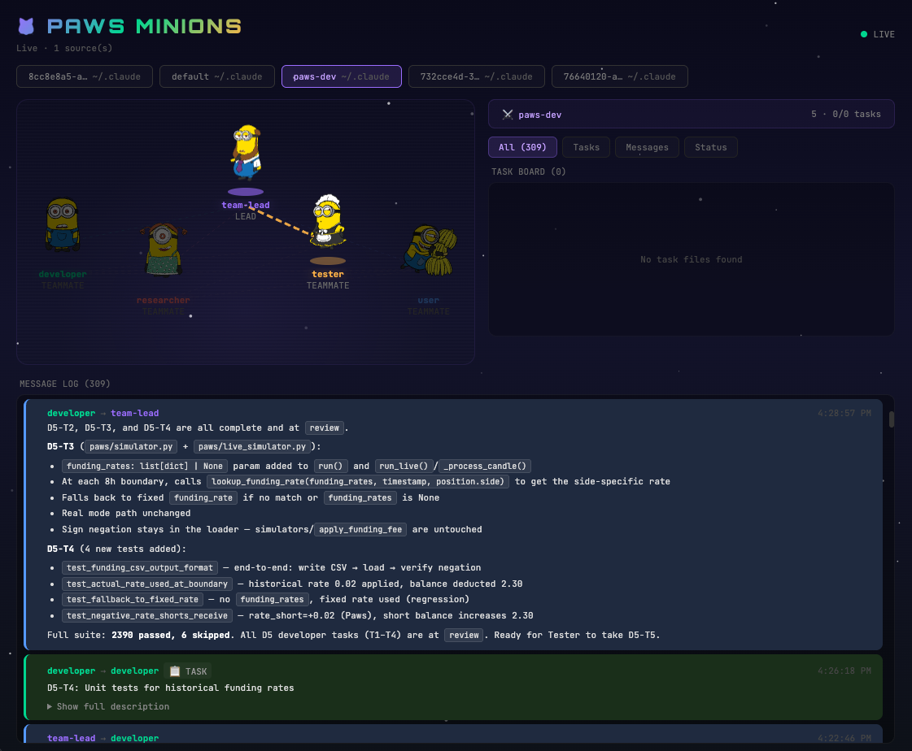

# ⚔️ Claude Agent Team Visualizer

> **Caution:** This tool was generated by Claude and is experimental. It may not work perfectly or cover all edge cases. Use with caution in production environments.



Anime/RPG-style real-time visualizer for Claude Code **Agent Teams**.

Watches your `.claude/teams/` and `.claude/tasks/` directories and renders agents as game characters with live message feeds and task boards.

## Limitations

This visualizer **only works with Agent Teams mode** — it does NOT support the subagents mode (agents spawned via the `Agent` tool inside a Claude Code session).

| Mode | Description | Supported |
|---|---|---|
| **Agent Teams** | Persistent named agents defined in `~/.claude/teams/`, communicate via inbox files | ✅ Yes |
| **Subagents** | Ephemeral agents spawned inline during a Claude Code session via the `Agent` tool | ❌ No |

Agent Teams must be explicitly enabled — see [Usage with Agent Teams](#usage-with-agent-teams) below.

## Quick Start

```bash
# 1. Install dependencies
npm run setup

# 2. Start both server + client
npm run dev
```

Then open **http://localhost:5173**

## How It Works

```
.claude/
├── teams/{team-name}/
│   ├── config.json          ← optional team config
│   └── inboxes/             ← agent inbox files (JSON)
│       ├── team-lead.json
│       └── agent-name.json
└── tasks/{team-name}/
    ├── 1.json               ← task files
    ├── 2.json
    └── .highwatermark
```

The **Node.js server** (`server.js`):
- Watches `.claude/` directories with `chokidar`
- Parses inboxes and tasks
- Streams updates to the React client via WebSocket

The **React client** (`client/`):
- Renders agents as anime characters on a battlefield
- Shows live message log with sender/receiver highlighting
- Displays task board with status colors
- Connection lines pulse when agents communicate

## Usage with Agent Teams

Make sure Agent Teams is enabled:

```bash
# In your environment or ~/.claude/settings.json
export CLAUDE_CODE_EXPERIMENTAL_AGENT_TEAMS=1
```

Then start a team in Claude Code:

```
Create an agent team to build the dashboard feature.
Spawn 3 teammates: API, frontend, tests.
```

The visualizer will automatically detect the team and render the agents.

## Specifying .claude Directories

By default, the server auto-detects two locations:
- `~/.claude` — your global Claude config (always checked)
- `./.claude` — a project-level `.claude` in the current working directory (if it exists)

You can override this with the `CLAUDE_DIR` environment variable or `--claude-dir` CLI flag:

```bash
# Watch a specific directory
CLAUDE_DIR=/path/to/project/.claude npm run dev

# Watch multiple directories (colon-separated)
CLAUDE_DIR=~/.claude:/path/to/project/.claude npm run dev

# CLI flag (repeatable)
node server.js --claude-dir ~/.claude --claude-dir /path/to/project/.claude
```

Priority order: CLI flags → `CLAUDE_DIR` env var → auto-detect default.

## Architecture

```
┌─────────────────┐     WebSocket      ┌──────────────────┐
│   server.js     │ ◄────────────────► │   React Client   │
│   (port 3847)   │                    │   (port 5173)    │
└────────┬────────┘                    └──────────────────┘
         │
    chokidar watch
         │
    .claude/
    ├── teams/
    └── tasks/
```

## Configuration

| Env Variable | Default | Description |
|---|---|---|
| `PORT` | `3847` | Server port |
| `CLAUDE_DIR` | `~/.claude` | Colon-separated list of `.claude` directories to watch |
| Client port | `5173` | Vite dev server |

## Running in Production

```bash
cd client && npm run build
# Serve built files from client/dist/ via the Express server
node server.js
```
